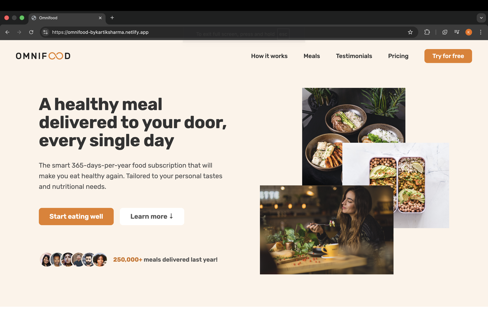
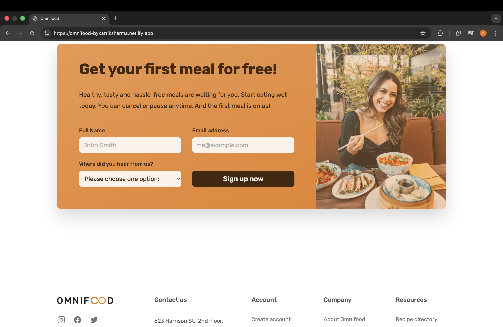
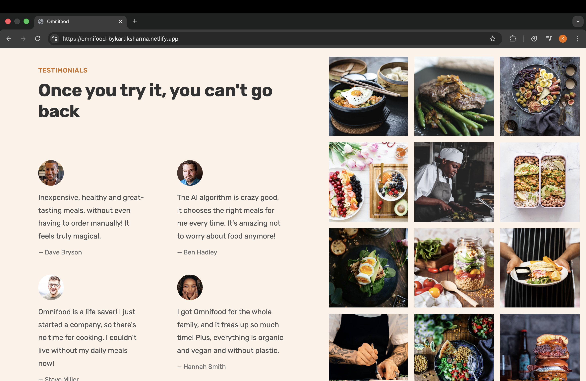

# 🍽️ Omnifood — A CSS Masterpiece

**Live Demo:** 👉 [omnifood-bykartiksharma.netlify.app](https://omnifood-bykartiksharma.netlify.app/)

Omnifood is a modern and visually captivating food website built entirely with **HTML and CSS**.  
Designed to be a **showcase of advanced CSS design principles**, Omnifood combines aesthetic precision, responsive layouts, and seamless user experience — all without relying on frameworks.

---

## ✨ Features

- 🌐 **Fully Responsive Design** — Perfectly adapts to all screen sizes  
- 🎨 **Pure CSS Styling** — No frameworks, just handcrafted CSS  
- 💫 **Smooth Animations & Hover Effects** — Enhances interactivity and elegance  
- 📐 **Pixel-Perfect Layouts** — Balanced spacing and clean typography  
- 🍴 **Modern Food-Themed UI** — Fresh, minimal, and appetizing visuals  

---

## 🛠️ Technologies Used

- **HTML5** for structure  
- **CSS3** for styling, responsiveness, and animations  

---

## 🚀 Live Preview

You can check out the live website here:  
👉 **[https://omnifood-bykartiksharma.netlify.app/](https://omnifood-bykartiksharma.netlify.app/)**

---

## 💡 Inspiration

This project was created as a **CSS masterpiece** — to demonstrate how far pure CSS can go in creating professional, responsive, and visually appealing web designs without JavaScript or external frameworks.

---

## 📸 Screenshots

---

## 👨‍💻 Author

**Kartik Sharma**  
[GitHub Profile](https://github.com/kartik9077)  
*Frontend Developer | Creative Web Designer*

---

⭐ *If you like this project, don’t forget to star the repo and share it!*  
